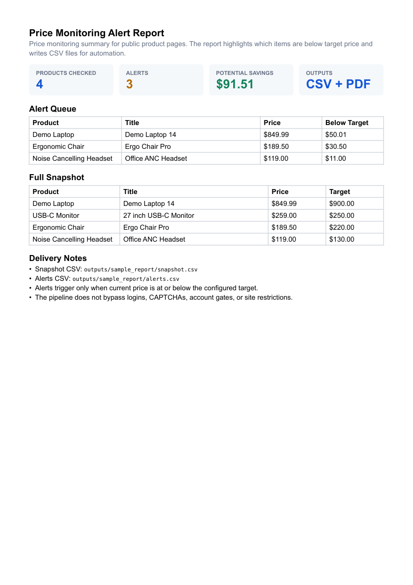

# Price Monitor Pipeline

[](https://github.com/emirhuseynrmx/price-monitor-pipeline/actions)
[](https://www.python.org/)

Python pipeline for tracking public product prices and generating clean alert reports.

Built for repeatable public price checks, CSV snapshots, and simple threshold alerts.

## What It Does

- reads product watch rules from JSON
- fetches public product pages
- extracts title and price using CSS selectors
- writes timestamped CSV snapshots
- compares current price against target price
- writes alert reports for products below threshold
- validates snapshot and alert dataframes with Pandera
- writes a run manifest with source URLs, output files, and schema fingerprint
- writes a Markdown summary report
- supports fixture-based testing without live network calls

## Demo

```bash
pip install -e ".[dev]"
monitor-prices \
  --config examples/watchlist.json \
  --out outputs/snapshot.csv \
  --alerts outputs/alerts.csv \
  --summary outputs/summary.md \
  --manifest outputs/manifest.json
```

Generate a sample PDF without live network calls:

```bash
generate-price-report --out outputs/sample_report
```

Sample report files:

- `outputs/sample_report/price_monitor_report.typ`
- `outputs/sample_report/price_monitor_report.pdf`
- `outputs/sample_report/snapshot.csv`
- `outputs/sample_report/alerts.csv`
- `outputs/manifest.json`



## Watchlist Example

```json
{
  "items": [
    {
      "name": "Demo Laptop",
      "url": "https://example.com/product/demo-laptop",
      "price_selector": ".price",
      "title_selector": "h1",
      "target_price": 900
    }
  ]
}
```

## Run Tests

```bash
ruff check .
pytest
```

## Scope

This project monitors public pages with stable selectors. It does not bypass logins, CAPTCHAs, account restrictions, or terms of service.
